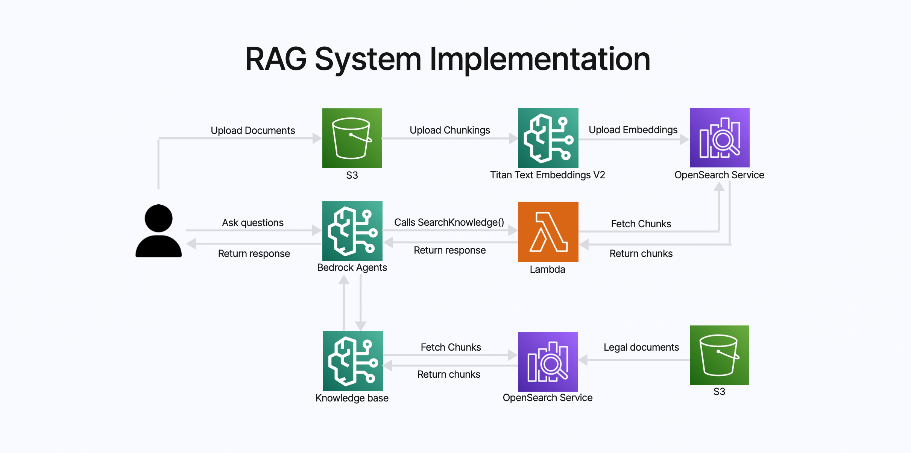
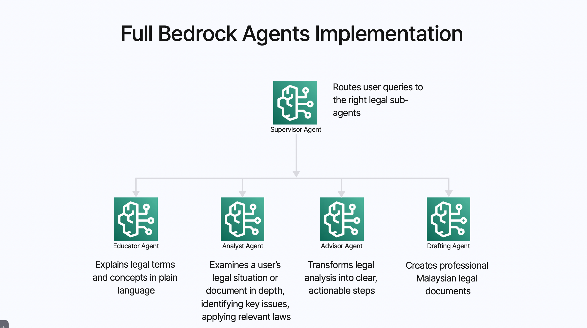

# ⚖️ LegalKaki: AI legal assistant built for the rakyat and SMEs. 

Our goal is simple: make legal documents accessible, understandable, and actionable.

---

## 🌍 Project Overview

LegalKaki bridges the gap between legal complexity and public understanding.

- **Accessible** — One app for SMEs to upload documents, chat, and get layman-friendly breakdowns.
- **Understandable** — Our AI provides context-aware answers powered by RAG, reading your documents and explaining them using real Malaysian legal context.
- **Actionable** — Users can draft or edit clauses in natural language, then send to lawyers for fast review — reducing cost, time, and friction.

### 🤝 Our Philosophy: Empowering, Not Replacing

**LegalKaki is not about replacing lawyers**: it's about empowering people to understand their legal needs *before* seeking professional help.

We believe that informed clients make better decisions and save everyone time. Our approach:

1. **Build Understanding First** — Users gain clarity on what they need (e.g., "I want a partnership agreement for my cafe with a 60/40 split")
2. **Connect to Professionals** — Once users know their specific requirements, we connect them with our partner law firms
3. **Win-Win Model** — Lawyers receive pre-qualified, well-informed clients who know exactly what they want, saving time and increasing efficiency

This creates a sustainable ecosystem where:
- ✅ Users get free access to legal clarity
- ✅ Lawyers focus on high-value work with prepared clients
- ✅ LegalKaki generates revenue through law firm partnerships, not user paywalls

---

## 🧠 Core AI Workflow (RAG System Implementation)

LegalKaki uses an advanced Retrieval-Augmented Generation (RAG) architecture for document understanding.



### 1. Upload & Chunking

Users upload legal PDFs, which are:
- Stored in **Amazon S3**
- Automatically extracted, chunked, and embedded using **Amazon Titan Text Embeddings V2** (1024-dim)

### 2. Indexing

Chunks are indexed into **OpenSearch Serverless**, creating a semantic + keyword searchable layer:

```json
{
  "tenant_id": "user123",
  "chat_id": "42",
  "text": "Clause 4 – Termination...",
  "embedding": [0.12, 0.45, ...]
}
```

### 3. Hybrid Search (via Lambda)

When users ask questions, Bedrock calls a Lambda function (`SearchKnowledge()`), which performs:
- **Keyword search** (BM25) for exact matches
- **Vector search** (KNN) for semantic similarity
- **Merged results** for best context recall

### 4. Bedrock Agent Response

The Bedrock Agent (**AWS Nova Premier**) combines retrieved chunks with its reasoning model, returning:
- Plain-language explanations
- Clause analysis
- Actionable recommendations
- Citations linking to the source document

---

## 🤖 Bedrock Agent Design

| Agent | Role | Function |
|-------|------|----------|
| **Educator Agent** | Explains terms and clauses | Simplifies legal language |
| **Analyst Agent** | Examines uploaded docs | Finds risks and obligations |
| **Advisor Agent** | Suggests next steps | Translates findings into actions |

### Current Hackathon Version
- Uses **one unified Bedrock Agent** to act as Educator, Analyst, and Advisor simultaneously.
- ✅ Optimized for real-time responses (~3s latency).

### Full Implementation (Future Roadmap)
- A **multi-agent system** coordinated by a Supervisor Agent, routing tasks to:
  - Educator, Analyst, Advisor, and Drafting Agent
- Enables professional-grade document drafting
- ⚠️ This setup produces higher-quality results but currently takes a few minutes per query — unsuitable for real-time hackathon use.


---

## 🧩 System Architecture

```
User → Frontend (Next.js)
        ↓
AWS Amplify → Cognito (Auth)
        ↓
Backend (FastAPI on Fargate + ECS)
        ↓
Lambda → OpenSearch → S3
        ↓
Bedrock Agent (Nova Premier)
```

### Key AWS Services Used

- **Amplify** → Hosts the Next.js frontend (CI/CD + auto-deploy)
- **Cognito** → Manages user authentication
- **Fargate + ECS** → Runs FastAPI backend
- **DynamoDB** → Stores chat and message history
- **RDS (PostgreSQL)** → Manages structured data (user context, session state)
- **OpenSearch Serverless** → Handles hybrid vector search
- **S3** → Stores uploaded and processed PDFs
- **Bedrock + Lambda** → Orchestrates RAG retrieval and response generation

---

## ⚙️ Environment Configuration

| Variable | Description | Default |
|----------|-------------|---------|
| `DEV_MODE` | Enable development mode (uses localhost backend) | `false` |
| `NEXT_PUBLIC_BACKEND_URL` | Manual backend URL override | - |
| `NEXT_PUBLIC_API_BASE_URL` | Production backend URL | `http://43.217.199.206:8000` |
| `NEXT_PUBLIC_API_TOKEN` | Backend authentication token | `ragflow-E1YWMxNmU4OTZkNTExZjBiNzUwMDI0Mm` |

### 🧩 Backend Resolution Priority

1. **Manual Override** → `NEXT_PUBLIC_BACKEND_URL`
2. **Development Mode** → `localhost:8000` (when `DEV_MODE=true`)
3. **Production Default** → `NEXT_PUBLIC_API_BASE_URL`

---

## 🚀 Getting Started

```bash
# Install dependencies
npm install

# Setup environment
cp .env.local.example .env.local
# Edit .env.local

# Run development server
npm run dev
```

Then open [http://localhost:3000](http://localhost:3000).

---

## 🗂️ Project Structure

```
src/
 ├─ app/           → Next.js app router pages
 ├─ components/    → Reusable UI components
 ├─ api/           → API client integration
 ├─ lib/           → Utilities & environment logic
 └─ types/         → TypeScript definitions
```

---

## 💡 API Integration Example

```typescript
import { api } from '@/api/endpoints';

const response = await api.collections.getCollections();
// Auto-selects backend based on DEV_MODE or production URL
```

---

## 🧭 Vision & Impact

- **MSME Empowerment**: 96.1% of Malaysian businesses are MSMEs — LegalKaki helps them navigate contracts confidently.
- **Risk Reduction**: Reduces the 60% early-stage failure rate caused by unclear agreements.
- **Access to Justice**: Brings legal clarity to every rakyat — not just those who can afford a lawyer.

---

## 🧾 Business Model

| Stream | Description |
|--------|-------------|
| **Free Core Features** | Upload, explain, and analyze documents remain **permanently free** to build our user base with informed, legally-aware customers. |
| **Law Firm Partnerships** | **Primary revenue source** — Partner law firms pay for access to pre-qualified clients who already understand their specific needs. |
| **Value Proposition for Lawyers** | Firms save hours on client intake and filtering, receiving customers who know exactly what they want (e.g., "60/40 cafe partnership agreement"). |
| **Premium Tools (Future)** | Mind map generation, advanced drafting assistants, and collaboration features for power users. |
| **Credit System (Future)** | Optional credits for enterprise features while keeping core understanding tools free. |

### 💡 Why This Works

**For Users:** Free access to legal clarity forever — no paywalls blocking understanding.

**For Lawyers:** Higher-quality leads who are ready to engage, saving time and increasing revenue per client.

**For LegalKaki:** Sustainable revenue from B2B partnerships instead of extracting from users who need help most.

---

### 📋 Real-World Examples

#### Example 1: Partnership Agreement

**Without LegalKaki:**
- Client: "I want to start a business with my friend"
- Lawyer spends 2 hours (often free consultation) explaining partnership structures
- Client: "Thanks, let me think about it" → 50% never return

**With LegalKaki:**
- Client: "I need a partnership agreement: 60/40 split, cafe business, Partner A operations/Partner B finance, vesting over 2 years"
- Lawyer: "Perfect, I can draft that. My fee is RM3,000, ready in 3 days"
- Client: "Yes, let's proceed" → Immediate engagement

---

#### Example 2: Employment Contract

**Without LegalKaki:**
- Client: "I'm hiring someone, do I need a contract?"
- Lawyer explains employment law basics, EA 1955, termination clauses (1.5 hours unpaid)
- Client: "Can I just use a template online?" → Lost opportunity

**With LegalKaki:**
- Client: "I need an employment contract with 3-month probation, RM4,500 salary, non-compete for 6 months in F&B sector, Selangor jurisdiction"
- Lawyer: "I'll customize that for your business. RM1,800, ready tomorrow"
- Client: "Great, here's my company details" → Done deal

---

#### Example 3: Rental Agreement Review

**Without LegalKaki:**
- Client: "Can you check my rental agreement? I think something's wrong"
- Lawyer reads 15-page document, explains every clause (2 hours)
- Client: "I already signed it, just wanted to know" → No revenue, wasted time

**With LegalKaki:**
- Client: "LegalKaki flagged Clause 7 (unilateral rent increase) and Clause 12 (tenant liable for structural repairs). Can you negotiate these two clauses for me?"
- Lawyer: "Yes, I'll draft amendments. RM800 flat fee"
- Client: "Perfect, I haven't signed yet" → Quick, profitable work

---

#### Example 4: Shareholder Agreement

**Without LegalKaki:**
- Client: "We're three co-founders, what do we need?"
- Lawyer gives 3-hour crash course on equity, vesting, exit rights, drag-along, tag-along clauses
- Client: "This is complicated, we'll discuss among ourselves first" → Months of back-and-forth

**With LegalKaki:**
- Client: "Three founders: 40/35/25 split, 4-year vesting with 1-year cliff, tag-along rights, ROFR on transfers. Founder C is advisor-only"
- Lawyer: "Clear terms. I'll draft the SHA for RM5,500"
- Client: "When can we sign?" → High-value engagement locked in

---

### 🎯 The Impact

Each example shows the same pattern:
- ✅ **Lawyers save 1-3 hours** of unpaid education time per client
- ✅ **Conversion rates increase** from ~50% to 80%+
- ✅ **Deal velocity accelerates** from weeks to days
- ✅ **Revenue per client increases** because scope is clear upfront
- ✅ **Client satisfaction improves** because they know what to expect

---


## 🧱 Credits

**Built by Team Tr3nity (2025)**

> *"We built LegalKaki not just as a tool — but as a piece of national digital infrastructure for access to justice."*

---

## Backend Implementation 
See [LegalKaki Backend](https://github.com/alpha031117/legalkaki_backend) for more details.
